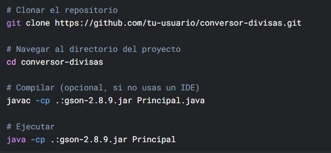
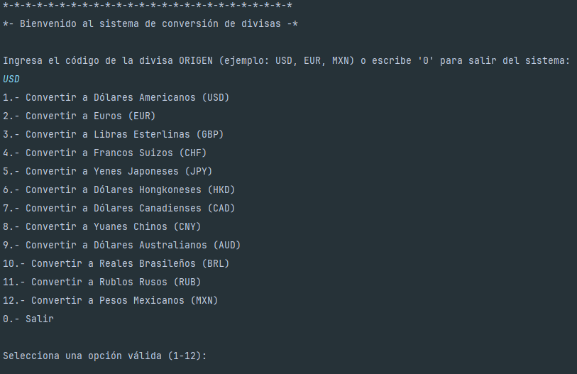
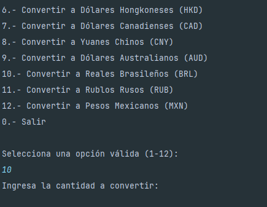
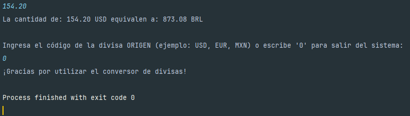
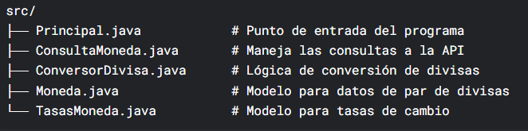

# README - Sistema de Conversión de Divisas 💰
## 📌 Descripción
Este proyecto es un conversor de divisas desarrollado en Java que permite obtener tasas de cambio en tiempo real y realizar conversiones entre diferentes monedas. 
El sistema se conecta a la API de ExchangeRate-API para obtener los datos más actualizados.
---
## 🌟 Características Principales
* ✅ Conversión en tiempo real entre múltiples divisas
* ✅ Soporte para 12 monedas diferentes (USD, EUR, GBP, CHF, JPY, HKD, CAD, CNY, AUD, BRL, RUB, MXN)
* ✅ Interfaz de usuario intuitiva por consola
* ✅ Validación de entradas del usuario
* ✅ Manejo de errores en conexiones API
---
## 🛠️ Tecnologías Utilizadas
* Java 17+
* HTTP Client de Java (para conexiones API)
* Gson (para parseo de JSON)
* ExchangeRate-API (fuente de datos)
---
## 📥 Instalación y Ejecución
### Requisitos previos:
1. JDK 17 o superior instalado
2. Conexión a Internet (para acceder a la API)

### Pasos para ejecutar:

- **Nota**: _Realizar los ajustes necesarios a tu proyecto._ 
---
## 🖥️ Uso del Programa
1. Al iniciar el programa, verás un mensaje de bienvenida.
2. Ingresa el código de la divisa de origen (ej. "USD", "EUR", "MXN").
3. Selecciona la divisa destino del menú mostrado (1-12).
4. Ingresa la cantidad a convertir.
5. El programa mostrará el resultado de la conversión.
6. Puedes realizar múltiples conversiones o salir con la opción 0.
---
## 📷 Capturas de Pantalla

---
## 📊 Estructura del Proyecto

---
## 👥 Autores

- **Crystian Muro** - Desarrollador del proyecto | 2025.

---
## 🤝 Contribuciones
Las contribuciones son bienvenidas. Por favor abre un issue o pull request con tus sugerencias.
